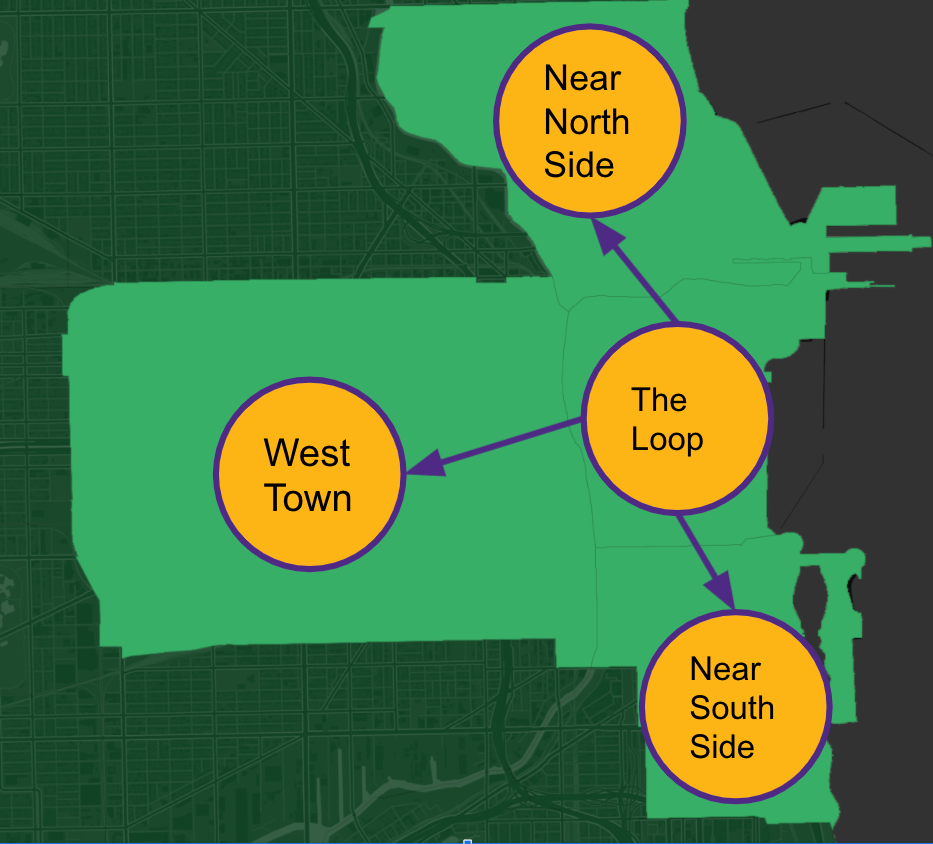

```{r setup, include=FALSE}
library(dplyr)
library(knitr)
knitr::opts_chunk$set(echo = TRUE)
```

# Cobb-Douglas Functional Form

We set the direction to use the Cobb-Douglas Production function to model the taxi trip flows in order to generate the counterfactuals.

Let our counterfactual model for a community $i$ be
$$Y = f(Q, D) = \omega R^\alpha D^\beta$$
where

* $Y$: taxi pickups (or realized demand) of a community $i$
* $R$: total taxi riders of a community $i$, which includes realized demand and unrealized demand. 
* $D$: available drivers relevant to community $i$


If we take a log-transformation of the CB function, it becomes a simple linear model for easier manipulation. 

$$log(Y) = log(\omega) + \alpha log(R) + \beta log(D)$$

After taking the log, $\alpha$ and $\beta$ becomes the "marginal productivity". The parameters can be interpreted as: a 1\% increase in $R$ or $D$ can lead to $\alpha$ or $\beta$ percentage change in pickups. 

## Time and Location Assumptions

Time: we assume taxi pickups have a cyclical pattern in weekdays during a specific time interval (i.e., 8:45 - 9:15 AM).

Location: We take a closed zone from the Chicago map, and focus on 4 community areas as presented in the figure below.

```{r zone, echo=FALSE, fig.align = 'center', out.width = "30%", fig.cap = "Target zone formed by 4 community areas (CAs)"}

```

So loading the data
```{r load-data}
df = read.csv("./data/cb_clean.csv")
df %>% head %>% kable
```

# Latent Demand
The problem we are having is that we don' t know anything about $R$, the total riders, because of data limitation. $R$ can be represented by:

$$
R = Y + R_L
$$
<!-- Jessica email on 1/10 -->
We sorta need total riders as a predictor for the model because we want "to make a prediction about total demand given a day/time window we want to include in experiment".

# Bayesian Model

## Production Function
Since we have 4 different communities, previous modeling attempts suggested treating each community as a separate spatial regime can produce better accuracy. Therefore, we can create the regimes in the model specification.

$$
\begin{aligned}
log(Y_i) &\sim \text{N}(\mu_i, \sigma) \\
\mu_i &= log(\omega_{[i]}) + \alpha_{[i]}log(R) + \beta_{[i]}log(D) \\
\omega_j &\sim \text{N} \; \text{for} \; j = 1 \dots 4 \\
\alpha_j &\sim \text{N} \; \text{for} \; j = 1 \dots 4 \\
\beta_j &\sim \text{N} \; \text{for} \; j = 1 \dots 4 \\
\sigma_j &\sim \text{Exp} \; \text{for} \; j = 1 \dots 4 \\
\end{aligned}
$$

For the latent demand part, the industry expert suggested to come up a strong prior on the conversion rate (Pickups / Requests) under the assumption that "requests are highly cyclical, meaning that the same time of week and place would roughly have the same demand". 

So we need to come up with a model that can infer the total demand, and fit together with the Cobb-Douglas production function. 

## Latent Demand Model
One possibility is to come up with a bivariate regression model using the conversion rate $\kappa$ where $\kappa$ should be strictly greater or equal to 1. 
$$
R_i = \lambda_i + \kappa_iY_i
$$
We discussed the possibility to use idle time to predict total riders, which might be useful to add it to the model. I think idle time is a useful proxy, that not only tells the traffic condition, but also give a sense of demand popularity. We can just add idle time to the linear model.

$$
R_i = \lambda_i + \kappa_iY_i + \gamma_iT_i
$$

We can fit this latent demand model with the pickup model stated above, and come up with priors for parameters $\kappa$ and $\gamma$.
$$
\begin{aligned}
R_i &\sim N(\mu_{i}, \tau) \\
\mu_i &= \lambda_{[i]} + \kappa_{[i]}Y + \gamma_{[i]}T\\
\lambda_j &\sim \text{N}\\
\kappa_j &\sim \text{log-normal (can be truncated?)} \\
\gamma_j &\sim \text{N}\\
\tau &\sim \text{Exp}\\
\end{aligned}
$$

Regardless of what we do, my concern is, if we use the conversion rate, we are using the response variable $Y$ on both side of the equation, which can cause troublesome endogeneity problem. I am not sure if Bayesian fitting of the regression model can allow us to ignore this problem, but we probability need instrument for 2 stage least square.   
